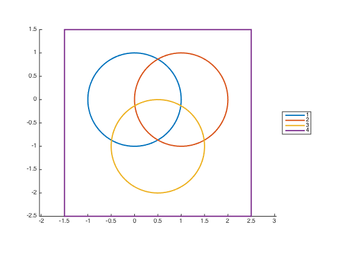
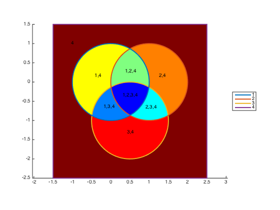

## multiplepolyint.m Documentation

This function calculates the intersection between multiple polygons.

### Syntax

```
[xnew, ynew, indices] = multiplepolyint(x, y)
[xnew, ynew, indices] = multiplepolyint(x, y, flag)
```

See function help for description of input and output variables.

### Example

Plot example polygons: 3 overlapping circles inside a square:

```matlab
hold on;
axis equal;
xy = [x; y];
h = plot(xy{:}, 'linewidth', 2);
legend(h, cellstr(num2str((1:4)')), 'location', 'eastoutside');
```



Now calculate and label the various intersecting regions:

```matlab
% Calculate

[xint, yint, idx] =  multiplepolyint(x,y);

% Plot
 
np = length(xint);
col = jet(np);

for ii = 1:length(xint)
    [f,v] = poly2fv(xint{ii}, yint{ii});
    hp = patch('faces', f, 'vertices', v);
    set(hp, 'edgecolor', 'none', 'facecolor', col(ii,:));
    
    str = sprintf('%d,', idx{ii});
    if isequal(idx{ii}, 4)
        xytxt = [-1 1];
    else
        xytxt = mean(v);
    end
    text(xytxt(1), xytxt(2), str(1:end-1), 'horiz', 'center');
    
end
uistack(h, 'top');
```

